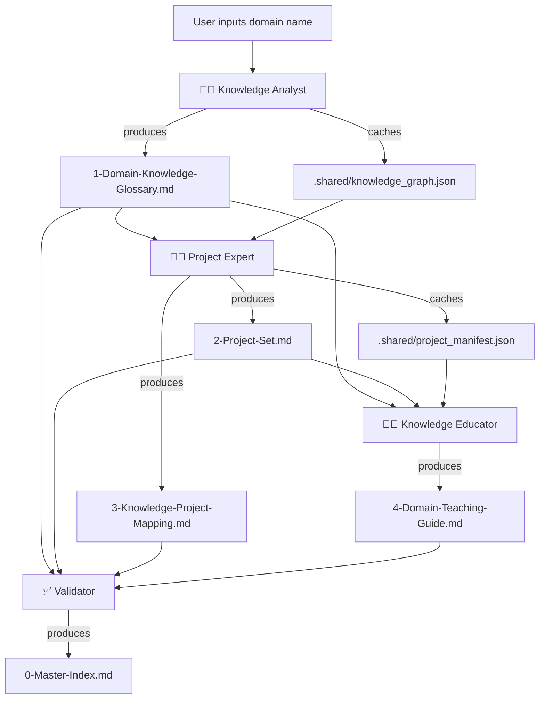

# 🧠 Knowledge Engine Orchestrator

[中文](./README.md) | **English**

> **TL;DR**: A plug-and-play pipeline that transforms any domain knowledge into a permanently linked Obsidian knowledge base — through automated **decomposition → project mapping → pedagogical conversion**.

---

## 📌 Value Proposition

### What problem does this plugin solve?

When building courses or self-learning a new domain, you've likely encountered these three painful bottlenecks:

| Pain Point | Manifestation |
| :--- | :--- |
| **📄 Fragmented Knowledge** | Concepts are scattered across notes, docs, and memory, making it impossible to form a systemic mental model. |
| **🎯 Theory-Practice Gap** | You learn theories but can't find real projects to apply them; or you finish projects but forget the underlying principles. |
| **🔗 Document Silos** | Knowledge lists, project docs, and teaching materials exist in isolation — no cross-referencing, no efficient retrieval. |

### What value does this plugin deliver?

This plugin embeds three dedicated AI experts that operate in a **strict, science-backed sequence** — *decompose first, design projects second, teach third* — to automatically transform any input domain (e.g., "Prompt Engineering", "Python Data Analysis") into a **highly structured, bidirectionally linked** Obsidian knowledge asset:

1. **Knowledge Analyst** → Exhaustively enumerates all core domain knowledge points with dependency mapping.
2. **Project Expert** → Maps every single knowledge point to real-world projects, achieving **100% coverage**.
3. **Knowledge Educator** → Bundles knowledge into digestible "teaching units" with precise anchors to corresponding project steps.

The end result is no longer a pile of isolated documents, but a **permanently maintainable, cross-linkable, and incrementally extensible** personal knowledge base.

---

## 🧩 Target Audience

- **Content Creators / Course Designers** → Rapidly generate structured curricula with aligned projects.
- **Self-Learners** → Build a clear learning path that balances theory and practice.
- **AI EdTech Developers** → Use this pipeline as the content-generation infrastructure for your products.
- **Anyone** who wants to turn an "input domain" into **structured, reusable knowledge assets**.

---

## 🔄 Core Workflow

The diagram below illustrates the **strictly sequential orchestration** of the three internal Skills and the flow of deliverables:



> **Design Principles**:
> - **Strict Ordering**: The glossary must exist before project design; project IDs must exist before the teaching guide can anchor to them precisely.
> - **Cache Decoupling**: The `.shared/` directory holds standardized JSON middleware, ensuring stable data transfer between Skills.
> - **Human-Machine Separation**: JSON feeds downstream Skills; Markdown serves human reading and Obsidian rendering. Each does its job.

---

## 📂 Plugin Directory Structure

```text
./
├── Skill.md                              # 【Core】Master orchestrator — defines pipeline & extension contracts
│
├── _agents/                              # 【Extension Hub】Stores all sub-Skill definitions
│   ├── knowledge-analyst.md
│   ├── project-expert.md
│   └── knowledge-educator.md
│
├── .shared/                              # 【Cache Layer】Standardized middleware (auto-generated, DO NOT edit manually)
│   ├── knowledge_graph.json
│   ├── project_manifest.json
│   └── teaching_outline.json
│
└── knowledge-bases/                      # 【Output Layer】Final user-facing knowledge assets
    └── [your-domain-name]/
        ├── 0-Master-Index.md             # Validator output: coverage heatmap + full reference index
        ├── 1-Domain-Knowledge-Glossary.md       # Knowledge Analyst output
        ├── 2-Project-Set.md                     # Project Expert output
        ├── 3-Knowledge-Project-Mapping.md       # Project Expert output
        └── 4-Domain-Teaching-Guide.md           # Knowledge Educator output
```

---

## 🚀 Quick Start (3 Steps)

### Step 1: Environment

- An AI client that supports Markdown rendering (e.g., Obsidian with Copilot plugin, or directly in this chat interface).
- **Obsidian is recommended** for the best bi‑directional linking experience, but plain text editors work just fine.

### Step 2: Installation

Clone or copy all files from this repository into your plugin management directory (e.g., `your-obsidian-vault/.plugins/knowledge-engine/`).

### Step 3: Trigger Execution

In your AI conversation, enter a command like:

> **“Use the Knowledge Engine to build a complete knowledge base for 'Prompt Engineering'.”**

The system will automatically execute the full pipeline and generate all 5 Markdown documents under `knowledge-bases/Prompt-Engineering/`.

---

## 📄 Deliverables Breakdown (What You Get)

| File | Content Summary | Core Value |
| :--- | :--- | :--- |
| **0-Master-Index.md** | Full knowledge graph (Mermaid diagram) + reference list for each knowledge point ID | Bird's-eye view; instantly locate where any concept is applied across projects and teaching units |
| **1-Domain-Knowledge-Glossary.md** | Structured table: ID, name, difficulty, prerequisites, relationships | The complete domain skeleton — the single source of truth for all downstream outputs |
| **2-Project-Set.md** | Full-fledged projects following the 5+2 framework (Context/Theory/Steps/Deviation/Acceptance + Mapping) | Each project covers a cluster of knowledge points, with **quantified** acceptance criteria |
| **3-Knowledge-Project-Mapping.md** | Bidirectional lookup table: Knowledge ID ↔ Project ID ↔ Application Step | Instantly answer: “In which project step is this knowledge point applied?” |
| **4-Domain-Teaching-Guide.md** | Unit-based teaching content (Value Anchor + Deep Dive + Analogy + Inquiry + Practice Hook) | Each unit ends with a hook that precisely links to `[[2-Project-Set#Proj-XXX]]` — learn then practice |

---

## 🔗 Obsidian Bi‑directional Linking Example

Opening any output document, you'll see internal links like this:

```markdown
# 4-Domain-Teaching-Guide.md

## Teaching Unit EDU-003: Pandas Data Cleaning

### Practice Hook
> The knowledge in this unit will be deliberately applied in [[2-Project-Set#Proj-002|Project Proj-002, Step 2.3]].
> Watch out: if the missing-value ratio exceeds 30%, you may encounter the "statistical bias amplification" mentioned in [[1-Domain-Knowledge-Glossary#PCE-007|PCE-007 Outlier Detection]].
```

In Obsidian, Cmd/Ctrl + click any link to **jump instantly** to the corresponding project step — enabling frictionless three‑way navigation between *Teaching Guide ↔ Knowledge Glossary ↔ Project Set*.

---

## 🎛️ Advanced Usage (Flexible Scheduling & Extension)

### Partial Re‑run (Save Tokens, Iterate Faster)

If you only need to regenerate the "Teaching Guide" without re‑decomposing the domain or re‑designing projects:

1. Open `Skill.md`.
2. In the `pipeline` configuration, set `enabled: false` for both `step-analyze` and `step-project`.
3. Trigger the run command again.

The system will **automatically skip** the first two stages and read the cached JSON from `.shared/`, executing only the Educator stage.

### Adding a Custom Skill (Hot‑Swap Extension)

Suppose you later want to add an "Interview Question Generator":

1. Create `_agents/interview-generator.md` and define its role and output format.
2. Append a new step to the `pipeline` list in `Skill.md`:

```yaml
- id: step-interview
  agent: _agents/interview-generator.md
  depends_on: [step-teach]
  input_source: ".shared/teaching_outline.json"
  outputs_markdown: ["knowledge-bases/[domain]/5-Interview-Questions.md"]
  enabled: true
```

No changes to existing files are required — the new Skill seamlessly joins the pipeline.

---

## ⚠️ Important Notes & Constraints

- **AI‑Generated Content**: All outputs are produced by LLMs. Users are strongly advised to review and adjust the content based on their own domain expertise to ensure accuracy.
- **ID Immutability (Critical)**: To preserve Obsidian link integrity, once a `Knowledge Point ID` (e.g., `PCE-001`) is generated, **it must never be changed**. If a knowledge point needs revision, mark it as "deprecated" and create a new ID — never rename or delete an existing ID directly.
- **Read‑Only Cache**: The JSON files under `.shared/` are maintained automatically by the system. **Do not edit them manually**, as this may break downstream Skill execution.

---

## 📜 Changelog

| Version | Date | Updates |
| :--- | :--- | :--- |
| v1.0.0 | 2026-06-25 | Initial release: Knowledge Analyst, Project Expert, Knowledge Educator with Obsidian bi‑linking and hot‑swap extensibility |

---

## 🤝 Contributing & Feedback

Issues and PRs are welcome. If you'd like to integrate a new Skill, please refer to the "Advanced Usage" extension guidelines.

---

**Happy Building — make your knowledge assets come alive!** 🚀