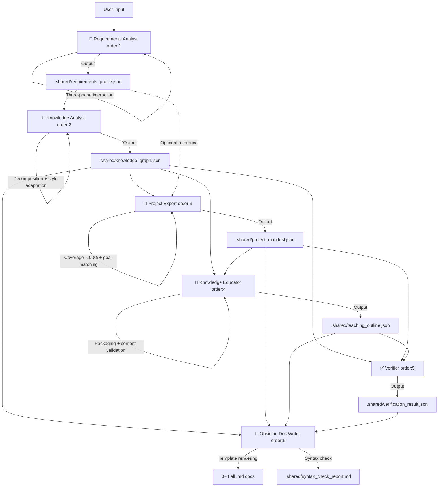

# 🧠 Knowledge Engine Orchestrator v2.8

**English** | [中文](./README.md)

> **TL;DR**: Input a learning direction → Requirements Analyst triangulates scope via three-phase interaction → 6 Skills auto-chain by order → permanently linked Obsidian knowledge base. v2.8 brings comprehensive optimizations to three core Skills with enhanced data contracts, style customization, and automated quality checks.

---

## 📌 Value Proposition

| Pain Point | Manifestation |
| :--- | :--- |
| **📄 Fragmented Knowledge** | Concepts scattered; no systemic mental model. |
| **🎯 Theory-Practice Gap** | Can't find real projects to apply what you learned. |
| **🔗 Document Silos** | No cross-referencing between knowledge, projects, and teaching materials. |

### How we solve it

| order | Skill | Output |
|:---:|:---|:---|
| 1 | **Requirements Analyst** | Three-phase interaction (scope → profile → config) → `requirements_profile.json` |
| 2 | **Knowledge Analyst** | Systematic decomposition with subject abbreviation, cross-subject dependencies, style fields, input validation → `knowledge_graph.json` |
| 3 | **Project Expert** | Context-driven project design (100% mapping + goal matching + load control) → `project_manifest.json` |
| 4 | **Knowledge Educator** | Packaging algorithm (clustering + coupling + cross-subject), uniqueness constraint, content auto-validation, orphan handling → `teaching_outline.json` |
| 5 | **Verifier** | Coverage / link validity / dependency closure check → `verification_result.json` |
| 6 | **Obsidian Doc Writer** | Template-based rendering of all 5 Markdown docs + auto syntax correction |

---

## 🔄 Core Workflow



> **v2.8 Architecture**: Entry point is `plugins/knowledge-engine-orchestrator/skill/requirements-analyst` (Requirements Analyst). Three core Skills (Knowledge Analyst, Project Expert, Knowledge Educator) fully optimized with enhanced data structures, style-driven content generation, and automated quality gates.

---

## 📂 Directory Structure

```text
./
├── plugins/
│   └── knowledge-engine-orchestrator/
│       ├── skill/                            ← 6 independent Skills
│       │   ├── requirements-analyst/Skill.md     ← [order:1] Requirements Analyst (entry)
│       │   ├── knowledge-analyst/Skill.md        ← [order:2] Knowledge Analyst
│       │   ├── project-expert/Skill.md           ← [order:3] Project Expert
│       │   ├── knowledge-educator/Skill.md       ← [order:4] Knowledge Educator
│       │   ├── verifier/Skill.md                 ← [order:5] Verifier
│       │   └── obsidian-doc-writer/Skill.md      ← [order:6] Obsidian Doc Writer
│       │
│       ├── schemas/                          ← Rules: Pipeline config + JSON Schema
│       │   ├── pipeline.config.yml               ← order sequence + rules
│       │   ├── requirements_profile.schema.json
│       │   ├── knowledge_graph.schema.json       ← v2.8
│       │   ├── project_manifest.schema.json      ← v2.8
│       │   ├── teaching_outline.schema.json      ← v2.8
│       │   └── verification_result.schema.json
│       │
│       └── templates/                        ← 5 standardized document templates
│           ├── knowledge-checklist.template.md
│           ├── project-collection.template.md
│           ├── teaching-guide.template.md
│           ├── master-index.template.md
│           └── progress-tracker.template.md
│
└── knowledge-bases/                      ← Output: user-facing knowledge assets
    └── [domain-name]/
        ├── .shared/                      ← Per-domain JSON middleware (isolated)
        ├── 0-Master-Index.md
        ├── 1-Domain-Knowledge-Glossary.md
        ├── 2-Project-Set.md
        ├── 3-Domain-Teaching-Guide.md
        └── 4-Progress-Tracker.md
```

---

## 🚀 Quick Start

### Trigger

> **"Use the Requirements Analyst to analyze 'Prompt Engineering'."**

The Requirements Analyst will run three-phase interaction, then auto-chain subsequent Skills by order.

### With Parameters

> **"Analyze 'Python Data Analysis', granularity=G3, depth=D2, style=面试突击型, max_points=20."**

| Parameter | Options | Default |
|:---|:---|:---|
| `granularity` | `G1` / `G2` / `G3` / `G4` | `G3` |
| `depth` | `D1` / `D2` / `D3` | `D2` |
| `max_points` | 5~200 | `20` |
| `style` | 标准系统型 / 面试突击型 / 项目驱动型 / 学术严谨型 / 科普故事型 | `标准系统型` |

---

## 📄 Deliverables

| File | Content |
| :--- | :--- |
| **0-Master-Index.md** | Verification report + Mermaid graph + mapping table + reference index + learning path |
| **1-Domain-Knowledge-Glossary.md** | Structured table: ID, name, difficulty, subject, prerequisites, exam weight/scenario tags |
| **2-Project-Set.md** | Context-driven projects with quantified acceptance criteria, estimated hours, and goal matching |
| **3-Domain-Teaching-Guide.md** | Unit-based teaching with estimated minutes, cross-subject combined units, and orphan handling |
| **4-Progress-Tracker.md** | Checkbox tracker per knowledge point ID |

---

## 🔄 Checkpoint Resume

- **Auto-skip**: If JSON cache exists and upstream hash unchanged, Skill asks to reuse
- **Force re-run**: Type "force full re-run"
- **Partial update**: Re-run only the changed Skill + order:6

Each Skill independently reports:

```
✅ [2/6] Knowledge Analyst Done
   Subjects covered: 3/3 / 18 knowledge points decomposed
   Beginner 8 / Intermediate 7 / Advanced 3
   Granularity: G3 / Depth: D2 / Style: 面试突击型
   ──────────────────────────
   Next: Project Expert (order: 3)
   Depends on: knowledge-bases/{domain}/.shared/knowledge_graph.json
```

---

## 🎛️ Extension

### Add a Skill
Insert a step in `plugins/knowledge-engine-orchestrator/schemas/pipeline.config.yml` with `order` and `depends_on`, then create `plugins/knowledge-engine-orchestrator/skill/your-agent/Skill.md`. Layer-1 Skills output JSON only; Layer-2 handles Markdown.

### Add a Doc Type
Create `.template.md` in `plugins/knowledge-engine-orchestrator/templates/`, append `outputs_markdown` in pipeline config, add rendering logic in obsidian-doc-writer.

### Custom Subject Syllabus
Place `subjects_syllabus.json` under `.shared/` — the Knowledge Analyst will use it as the skeleton for stable, reproducible knowledge decomposition.

---

## ⚠️ Important

- **AI-Generated**: Review outputs for accuracy.
- **ID Immutability**: Once generated, knowledge point IDs (e.g., `PYB-001`) must never change. Format: `{SubjectAbbreviation}-{NNN}`.
- **Read-Only Cache**: `.shared/` JSON files are auto-maintained — do not edit manually.

---

> See [CHANGELOG.md](./CHANGELOG.md) for full version history.
