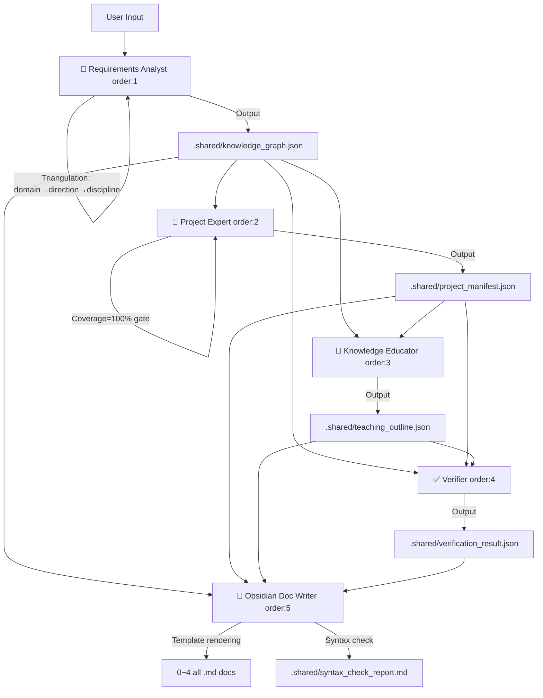

# 🧠 Knowledge Engine Orchestrator v2.6

**English** | [中文](./README.md)

> **TL;DR**: Input a learning direction → Requirements Analyst triangulates scope via Three-Level Decomposition → 5 Skills auto-chain by order → permanently linked Obsidian knowledge base. v2.6 refactored to distributed self-orchestration, each Skill independently reports status.

---

## 📌 Value Proposition

| Pain Point | Manifestation |
| :--- | :--- |
| **📄 Fragmented Knowledge** | Concepts scattered; no systemic mental model. |
| **🎯 Theory-Practice Gap** | Can't find real projects to apply what you learned. |
| **🔗 Document Silos** | No cross-referencing between knowledge, projects, and teaching materials. |

### How we solve it

| order | Skill | Output |
|:---:|:---|:---|
| 1 | **Requirements Analyst** | Triangulates scope (domain→direction→discipline) + decomposes knowledge → `knowledge_graph.json` |
| 2 | **Project Expert** | Maps 100% knowledge points to real projects → `project_manifest.json` |
| 3 | **Knowledge Educator** | Unit packaging + 5-dimension pedagogy → `teaching_outline.json` |
| 4 | **Verifier** | Coverage / link validity / dependency closure check → `verification_result.json` |
| 5 | **Obsidian Doc Writer** | Template-based rendering of all 5 Markdown docs + auto syntax correction |

---

## 🔄 Core Workflow



> **v2.6 Architecture**: Entry point is `skill/knowledge-analyst` (Requirements Analyst). Each Skill self-orchestrates by `order` in `schemas/pipeline.config.yml` and independently reports `[N/5]` status.

---

## 📂 Directory Structure

```text
./
├── Skill.md                              ← Compatibility redirect entry
│
├── skill/                                ← 5 independent Skills
│   ├── knowledge-analyst/Skill.md        ← [order:1] Requirements Analyst (entry)
│   ├── project-expert/Skill.md           ← [order:2] Project Expert
│   ├── knowledge-educator/Skill.md       ← [order:3] Knowledge Educator
│   ├── verifier/Skill.md                 ← [order:4] Verifier
│   └── obsidian-doc-writer/Skill.md      ← [order:5] Obsidian Doc Writer
│
├── schemas/                              ← Rules: Pipeline config + JSON Schema
│   ├── pipeline.config.yml               ← order sequence + rules
│   ├── knowledge_graph.schema.json
│   ├── project_manifest.schema.json
│   ├── teaching_outline.schema.json
│   └── verification_result.schema.json
│
├── templates/                            ← 5 standardized document templates
│   ├── knowledge-checklist.template.md
│   ├── project-collection.template.md
│   ├── teaching-guide.template.md
│   ├── master-index.template.md
│   └── progress-tracker.template.md
│
├── docs/
│   └── 领域知识分析师-设计文档.md
│
└── knowledge-bases/                      ← Output: user-facing knowledge assets
    └── [domain-name]/
        ├── .shared/                      ← Per-domain JSON middleware (isolated)
        ├── 0-Master-Index.md
        ├── 1-Domain-Knowledge-Glossary.md
        ├── 2-Project-Set.md
        ├── 3-Domain-Teaching-Guide.md
        └── 4-Progress-Tracker.md
```

---

## 🚀 Quick Start

### Trigger

> **"Use the Knowledge Analyst to analyze 'Prompt Engineering'."**

The Requirements Analyst will triangulate scope (domain→direction→discipline), then auto-decompose knowledge points and chain subsequent Skills by order.

### With Parameters

> **"Analyze 'Python Data Analysis', granularity=fine, style=practical, max_points=80."**

| Parameter | Options | Default |
|:---|:---|:---|
| `granularity` | `coarse` / `medium` / `fine` | `medium` |
| `depth_mode` | `overview` / `comprehensive` | `comprehensive` |
| `max_knowledge_points` | positive integer | `150` |
| `style_profile` | `academic` / `practical` / `certification` | `academic` |

---

## 📄 Deliverables

| File | Content |
| :--- | :--- |
| **0-Master-Index.md** | Verification report + Mermaid graph + mapping table + reference index + learning path |
| **1-Domain-Knowledge-Glossary.md** | Structured table: ID, name, difficulty, prerequisites, relationships |
| **2-Project-Set.md** | 5+2 framework projects with quantified acceptance criteria |
| **3-Domain-Teaching-Guide.md** | Unit-based teaching with precise hooks to project steps |
| **4-Progress-Tracker.md** | Checkbox tracker per knowledge point ID |

---

## 🔄 Checkpoint Resume

- **Auto-skip**: If JSON cache exists and upstream unchanged, Skill asks to reuse
- **Force re-run**: Type "force full re-run"
- **Partial update**: Re-run only the changed Skill + order:5

Each Skill independently reports:

```
✅ [2/5] Project Expert Done
   8 projects (beginner 3 / intermediate 4 / advanced 1)
   Coverage: 100%
   ──────────────────────────
   Next: Knowledge Educator (order: 3)
   Depends on: knowledge-bases/{domain}/.shared/project_manifest.json
```

---

## 🎛️ Extension

### Add a Skill
Insert a step in `schemas/pipeline.config.yml` with `order` and `depends_on`, then create `skill/your-agent/Skill.md`. Layer-1 Skills output JSON only; Layer-2 handles Markdown.

### Add a Doc Type
Create `.template.md` in `templates/`, append `outputs_markdown` in pipeline config, add rendering logic in obsidian-doc-writer.

---

## ⚠️ Important

- **AI-Generated**: Review outputs for accuracy.
- **ID Immutability**: Once generated, knowledge point IDs (e.g., `PCE-001`) must never change.
- **Read-Only Cache**: `.shared/` JSON files are auto-maintained — do not edit manually.

---

> See [CHANGELOG.md](./CHANGELOG.md) for full version history.
