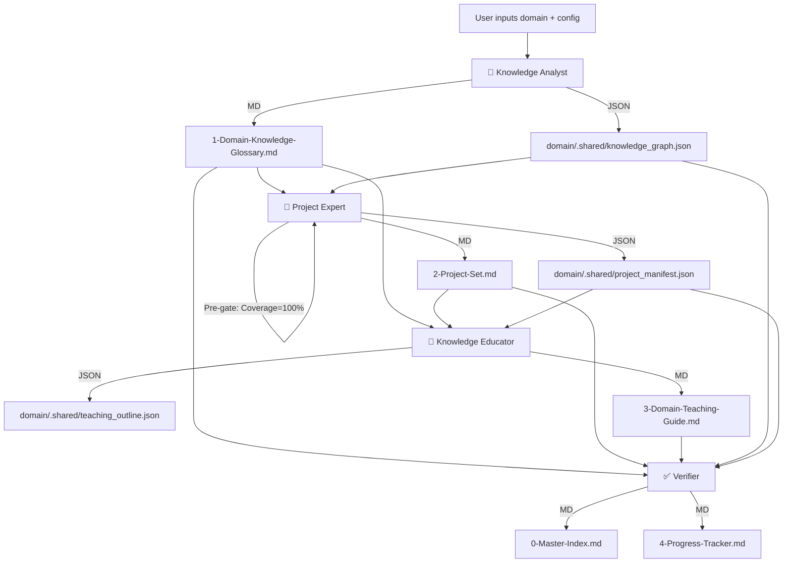

# 🧠 Knowledge Engine Orchestrator v2.3

[中文](./README.md) | **English**

> **TL;DR**: A plug-and-play pipeline that transforms any domain knowledge into a permanently linked Obsidian knowledge base — through automated **decomposition → project mapping → pedagogical conversion → verification**. Now with parameterized config, checkpoint resume, pre-validation gates, and progress feedback.

---

## 📌 Value Proposition

### What problem does this plugin solve?

When building courses or self-learning a new domain, you've likely encountered these three painful bottlenecks:

| Pain Point | Manifestation |
| :--- | :--- |
| **📄 Fragmented Knowledge** | Concepts are scattered across notes, docs, and memory, making it impossible to form a systemic mental model. |
| **🎯 Theory-Practice Gap** | You learn theories but can't find real projects to apply them; or you finish projects but forget the underlying principles. |
| **🔗 Document Silos** | Knowledge lists, project docs, and teaching materials exist in isolation — no cross-referencing, no efficient retrieval. |

### What value does this plugin deliver?

This plugin embeds four dedicated AI experts that operate in a **strict, science-backed sequence** — *decompose first, design projects second, teach third, verify last* — to automatically transform any input domain (e.g., "Prompt Engineering", "Python Data Analysis") into a **highly structured, bidirectionally linked** Obsidian knowledge asset:

1. **Knowledge Analyst** → Exhaustively enumerates all core domain knowledge points with dependency mapping.
2. **Project Expert** → Maps every single knowledge point to real-world projects, achieving **100% coverage**.
3. **Knowledge Educator** → Bundles knowledge into digestible "teaching units" with precise anchors to corresponding project steps.
4. **Verifier** → Validates coverage, link integrity, and dependency closure; generates knowledge graph and full reference index.

The end result is no longer a pile of isolated documents, but a **permanently maintainable, cross-linkable, and incrementally extensible** personal knowledge base.

---

## 🧩 Target Audience

- **Content Creators / Course Designers** → Rapidly generate structured curricula with aligned projects.
- **Self-Learners** → Build a clear learning path that balances theory and practice.
- **AI EdTech Developers** → Use this pipeline as the content-generation infrastructure for your products.
- **Anyone** who wants to turn an "input domain" into **structured, reusable knowledge assets**.

---

## 🔄 Core Workflow

The diagram below illustrates the **strictly sequential orchestration** of the four Agents and the flow of deliverables:



> **Design Principles**:
> - **Strict Ordering**: The glossary must exist before project design; project IDs must exist before the teaching guide can anchor to them precisely.
> - **Pre-Validation Gates**: After each step, the orchestrator validates output completeness and coverage before proceeding. Failures halt the pipeline immediately.
> - **Cache Decoupling**: The `knowledge-bases/[domain]/.shared/` directory holds standardized JSON middleware with per-domain isolation, ensuring multiple knowledge bases can coexist without overwriting each other.
> - **Human-Machine Separation**: JSON feeds downstream Agents; Markdown serves human reading and Obsidian rendering. Each does its job.

---

## 📂 Plugin Directory Structure

```text
./
├── Skill.md                              # 【Core】Master orchestrator v2.3 — defines pipeline, config & extension contracts
│
├── _agents/                              # 【Extension Hub】Stores all sub-Agent definitions
│   ├── knowledge-analyst.md
│   ├── project-expert.md
│   ├── knowledge-educator.md
│   ├── verifier.md                       # (v2.0 new) Verification Agent
│   └── obsidian-syntax-validator.md      # (v2.2 new) Obsidian Syntax Validator
│
├── schemas/                              # 【Spec Layer】JSON Schema definitions
│   ├── knowledge_graph.schema.json
│   ├── project_manifest.schema.json
│   └── teaching_outline.schema.json
│
└── knowledge-bases/                      # 【Output Layer】Final user-facing knowledge assets
    └── [your-domain-name]/
        ├── .shared/                      # 【Cache Layer】Per-domain middleware (auto-generated, isolated)
        │   ├── knowledge_graph.json
        │   ├── project_manifest.json
        │   ├── teaching_outline.json
        │   └── syntax_check_report.md    # Obsidian syntax validation report (internal)
        ├── 0-Master-Index.md             # Verification report + knowledge graph + mapping table + reference index
        ├── 1-Domain-Knowledge-Glossary.md
        ├── 2-Project-Set.md
        ├── 3-Domain-Teaching-Guide.md
        └── 4-Progress-Tracker.md
```

---

## 🚀 Quick Start (3 Steps)

### Step 1: Environment

- An AI client that supports Markdown rendering (e.g., Obsidian with Copilot plugin, or directly in this chat interface).
- **Obsidian is recommended** for the best bi‑directional linking experience, but plain text editors work just fine.

### Step 2: Installation

Clone or copy all files from this repository into your plugin management directory (e.g., `your-obsidian-vault/.plugins/knowledge-engine/`).

### Step 3: Trigger Execution

In your AI conversation, enter a command like:

> **"Use the Knowledge Engine to build a complete knowledge base for 'Prompt Engineering'."**

The system will automatically execute the full pipeline and generate all output documents under `knowledge-bases/Prompt-Engineering/`.

#### 🎛️ Parameterized Execution (v2.0 new)

You can also specify config parameters inline:

> **"Use the Knowledge Engine to build 'Python Data Analysis', granularity=fine, style=practical, max_points=80."**

| Parameter | Options | Default | Description |
|:---|:---|:---|:---|
| `granularity` | `coarse` / `medium` / `fine` | `medium` | Knowledge point granularity |
| `depth_mode` | `overview` / `comprehensive` | `comprehensive` | Generation depth |
| `max_knowledge_points` | any positive integer | `150` | Max knowledge points |
| `style_profile` | `academic` / `practical` / `certification` | `academic` | Output style preset |

---

## 📄 Deliverables Breakdown (What You Get)

| File | Content Summary | Core Value |
| :--- | :--- | :--- |
| **0-Master-Index.md** | Verification report + Mermaid knowledge graph + knowledge-project mapping table + full reference index + learning path | Bird's-eye view; instantly locate where any concept is applied across projects and teaching units |
| **1-Domain-Knowledge-Glossary.md** | Structured table: ID, name, difficulty, prerequisites, relationships | The complete domain skeleton — the single source of truth for all downstream outputs |
| **2-Project-Set.md** | Full-fledged projects following the 5+2 framework (Context/Theory/Steps/Deviation/Acceptance) | Each project covers a cluster of knowledge points, with **quantified** acceptance criteria |
| **3-Domain-Teaching-Guide.md** | Unit-based teaching content (Value Anchor + Deep Dive + Analogy + Inquiry + Practice Hook) | Each unit ends with a hook that precisely links to project steps — learn then practice |
| **4-Progress-Tracker.md** | Checkbox tracker per knowledge point ID + aggregate progress stats | Visual progress tracking for self-learners |

---

## 🔄 Checkpoint Resume (v2.0 New)

The plugin automatically detects cached outputs in `knowledge-bases/[domain]/.shared/`:

- **Auto-skip completed steps**: If `knowledge_graph.json` exists, the analyst step is automatically skipped.
- **Force full re-run**: Type "force full re-run" in the conversation to ignore all caches.
- **Partial update**: Set `enabled: false` for steps you don't need to re-run.

An execution plan is displayed before the pipeline starts:

```
═══════════════════════════════════════════
  📋 Knowledge Engine v2.3 Execution Plan
═══════════════════════════════════════════
  Domain: Python Data Analysis
  Config:
    - Granularity: medium
    - Depth: comprehensive
    - Max Points: 150
    - Style: academic
  Steps:
    [1/5] ✅ Done      Knowledge Analyst
    [2/5] ⏳ Pending   Project Expert
    [3/5] ⏳ Pending   Knowledge Educator
    [4/5] ⏳ Pending   Verifier
    [5/5] ⏳ Pending   Obsidian Syntax Check
═══════════════════════════════════════════
```

---

## 🎛️ Advanced Usage (Flexible Scheduling & Extension)

### Adding a Custom Skill (Hot‑Swap Extension)

Suppose you later want to add an "Interview Question Generator":

1. Create `_agents/interview-generator.md` and define its role and output format.
2. Append a new step to the `pipeline` list in `Skill.md`:

```yaml
- id: step-interview
  agent: _agents/interview-generator.md
  depends_on: [step-verify]
  input_source:
    - "knowledge-bases/[domain]/.shared/knowledge_graph.json"
    - "knowledge-bases/[domain]/.shared/teaching_outline.json"
  outputs_markdown: ["knowledge-bases/[domain]/5-Interview-Questions.md"]
  enabled: false
  checkpoint: true
```

No changes to existing files are required — the new Skill seamlessly joins the pipeline.

### Available Middleware (for Extension Skills)

| JSON File | Content | Produced By |
|:---|:---|:---|
| `knowledge-bases/[domain]/.shared/knowledge_graph.json` | All knowledge points | step-analyze |
| `knowledge-bases/[domain]/.shared/project_manifest.json` | Project structure + mappings | step-project |
| `knowledge-bases/[domain]/.shared/teaching_outline.json` | Teaching unit structure | step-teach |

---

## 🩺 Troubleshooting Guide

| Issue | Likely Cause | Solution |
|:---|:---|:---|
| **Pipeline halts mid-execution** | Pre-validation gate failed (missing JSON, coverage < 100%) | Check the last progress report for the specific failed check; use "force full re-run" |
| **Zero knowledge points generated** | Domain name too vague or niche | Try a more specific name, e.g., "Python Basics" instead of "Programming" |
| **Bidirectional links don't work** | Not viewing in Obsidian; WikiLink syntax not rendered | Open in Obsidian; or manually convert `[[]]` to standard Markdown links |
| **Missing knowledge point in output** | Coverage < 100%, project expert didn't map it | Check the verification report in `0-Master-Index.md`; re-run step-project |
| **Teaching guide hooks are imprecise** | Educator ran before project expert | Ensure step-project completes before step-teach (Pipeline enforces this by default) |
| **Excessive token consumption** | Domain too broad, knowledge points out of control | Set `max_knowledge_points` limit; use `granularity: coarse` |

---

## 📊 Token Consumption Estimates

| Domain Size | Knowledge Points | Projects | Est. Word Count | Est. Token Usage |
|:---|:---:|:---:|:---:|:---:|
| **Micro** (e.g., Python List Comprehensions) | 5-10 | 1-2 | ~3,000 | ~12K tokens |
| **Small** (e.g., Git Basics) | 15-30 | 3-5 | ~8,000 | ~30K tokens |
| **Medium** (e.g., Python Data Analysis) | 40-80 | 8-15 | ~20,000 | ~75K tokens |
| **Large** (e.g., ML Fundamentals) | 80-150 | 15-25 | ~40,000 | ~150K tokens |
| **Extra Large** (e.g., Full-Stack Web Dev) | 150+ | 25+ | ~60,000+ | ~220K+ tokens |

> **Note**: Estimates are for reference only. Actual consumption varies by domain complexity and LLM behavior. Start with a small domain for testing.

---

## ⚠️ Important Notes & Constraints

- **AI‑Generated Content**: All outputs are produced by LLMs. Users are strongly advised to review and adjust the content based on their own domain expertise to ensure accuracy.
- **ID Immutability (Critical)**: To preserve Obsidian link integrity, once a `Knowledge Point ID` (e.g., `PCE-001`) is generated, **it must never be changed**. If a knowledge point needs revision, mark it as "deprecated" and create a new ID — never rename or delete an existing ID directly.
- **Read‑Only Cache**: The JSON files under `knowledge-bases/[domain]/.shared/` are maintained automatically by the system. **Do not edit them manually**, as this may break downstream Agent execution.

---

> See [CHANGELOG.md](./CHANGELOG.md) for the complete version history.

---

## 🤝 Contributing & Feedback

Issues and PRs are welcome. If you'd like to integrate a new Agent, please refer to the "Advanced Usage" extension guidelines.

---

**Happy Building — make your knowledge assets come alive!** 🚀
