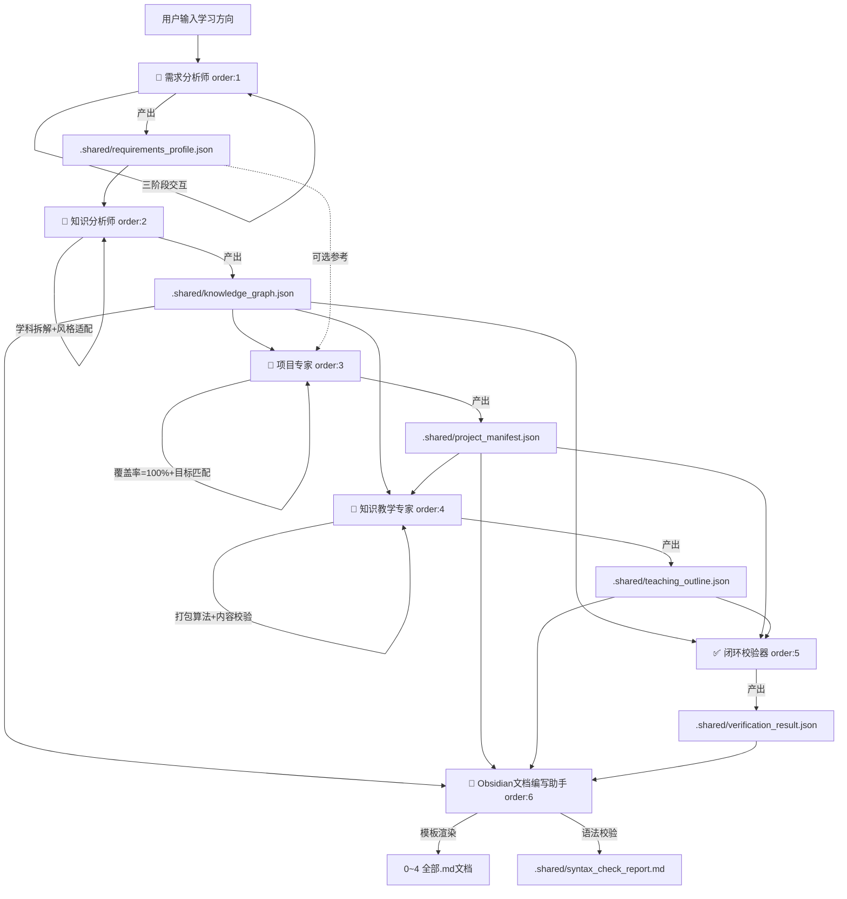

# 🧠 知识引擎编排器（Knowledge Engine Orchestrator）v2.9

**中文** | [English](./README-en.md)

> **一句话定义**：输入学习方向 → 需求分析师三拆锁定范围 → 六Skill按order自动串联 → 产出永久联动的 Obsidian 双链知识库。v2.9 完成 Claude Code Plugin 架构标准化，新增斜杠命令、事件钩子与插件清单。

---

## 📌 价值锚点

### 这个插件解决什么问题？

传统学习或课程设计过程中，你一定会遇到这三个致命痛点：

| 痛点 | 具体表现 |
| :--- | :--- |
| **📄 知识零散** | 知识点散落在各处，学了后面忘了前面，无法形成体系化认知。 |
| **🎯 学练脱节** | 学完理论找不到对应的真实项目去实践；做完项目又忘了背后的知识点。 |
| **🔗 文档孤岛** | 教学文档、项目文档、知识点清单互相独立，无法联动跳转，查找效率极低。 |

### 这个插件提供什么价值？

本插件内置六类 AI 专家，按 `plugins/knowledge-engine-orchestrator/schemas/pipeline.config.yml` 中定义的 `order` 顺序自动串联：

| order | Skill | 职责 |
|:---:|:---|:---|
| 1 | **需求分析师** | 三阶段交互：三拆锁定范围 → 学习者画像 → 生成规格配置 → `requirements_profile.json` |
| 2 | **知识分析师** | 体系化知识拆解（学科缩写/跨学科依赖/风格字段/输入校验） → `knowledge_graph.json` |
| 3 | **项目专家** | 情境驱动项目设计（100% 映射 + 目标匹配 + 负荷控制） → `project_manifest.json` |
| 4 | **知识教学专家** | 打包算法教学（唯一性约束/联动单元/内容校验/孤儿处理） → `teaching_outline.json` |
| 5 | **闭环校验器** | 覆盖率/双链/依赖闭环校验 → `verification_result.json` |
| 6 | **Obsidian文档编写助手** | 模板渲染全部 5 个 Markdown 文档 + 语法自动修正 |

最终，你得到的不再是一堆零散的文档，而是一个**可终身维护、可双向跳转、可迭代扩展**的个人知识库。

---

## 🧩 适用人群

- 知识博主 / 课程设计师：快速生成体系化课程大纲与配套项目。
- 自学者：构建自己的学习路径，理论与实践同步推进。
- AI 教育产品开发者：将此流水线作为内容生产的基础设施。
- 任何希望将"输入方向"转化为"结构化知识资产"的人。

---

## 🔄 核心工作流



> **v2.9 架构要点**：
> - **插件入口**为 `Skill.md`（根入口）→ `agents/requirements-analyst.md`（需求分析师），先通过三阶段交互精准锁定学习范围与生成规格
> - **标准化对齐**：`agents/`（Agent）+ `resources/`（Schemas + Templates）+ `commands/`（斜杠命令）+ `hooks/`（事件钩子）+ `.mcp.json`（MCP 服务）+ `pipeline-runner.py`（Python 编排器）
> - **知识分析师**（order:2）：基于学科缩写生成知识点 ID，支持跨学科依赖、面试星级/学术引用/场景标记等风格字段，含输入校验门与可行性估算
> - **项目专家**（order:3）：情境驱动设计，根据学习者画像调整项目背景与难度，支持目标匹配度自检与负荷控制
> - **知识教学专家**（order:4）：可执行打包算法（聚类+耦合+联动判断），归属唯一性约束，5 风格深度适配，内容自动校验，孤儿知识点处理
> - **两层分离**：层1（order:1-5）仅产出 JSON，层2（order:6）基于模板统一渲染全部 Markdown

---

## 📂 插件目录架构

```text
./
├── .claude-plugin/
│   ├── plugin.json                          ← 【清单层】插件运行时清单（必需）
│   └── marketplace.json                     ← 【清单层】市场发现描述
├── Skill.md                                 ← 【入口层】插件根入口文件
├── agents/                                  ← 【执行层】6 个独立 Agent 定义
│   ├── requirements-analyst.md                  ← [order:1] 需求分析师（插件入口）
│   ├── knowledge-analyst.md                     ← [order:2] 知识分析师
│   ├── project-expert.md                        ← [order:3] 项目专家
│   ├── knowledge-educator.md                    ← [order:4] 知识教学专家
│   ├── verifier.md                              ← [order:5] 闭环校验器
│   └── obsidian-doc-writer.md                   ← [order:6] Obsidian文档编写助手
├── skills/                                  ← 【工具层】可复用技能模块
│   └── schema-validator.md
├── resources/                               ← 【资源层】共享配置与模板
│   ├── schemas/                                 ← Pipeline 配置 + JSON Schema
│   │   ├── pipeline.config.yml                      ← order 顺序 + 运行规则
│   │   ├── requirements_profile.schema.json         ← 需求配置数据契约
│   │   ├── knowledge_graph.schema.json              ← v2.8 知识点数据结构
│   │   ├── project_manifest.schema.json             ← v2.8 项目映射数据结构
│   │   ├── teaching_outline.schema.json             ← v2.8 教学大纲数据结构
│   │   └── verification_result.schema.json          ← 校验结果数据结构
│   └── templates/                               ← 5 个标准化文档模板
│       ├── knowledge-checklist.template.md
│       ├── project-collection.template.md
│       ├── teaching-guide.template.md
│       ├── master-index.template.md
│       └── progress-tracker.template.md
├── commands/                                ← 【命令层】斜杠命令定义
│   ├── analyze-knowledge.md                     ← /analyze-knowledge 触发 Pipeline
│   ├── knowledge-status.md                      ← /knowledge-status 查看缓存
│   └── force-regenerate.md                      ← /force-regenerate 强制重跑
├── hooks/
│   └── hooks.json                           ← 【事件层】事件触发器配置
├── .mcp.json                                ← 【集成层】MCP 服务定义
├── pipeline-runner.py                       ← 【编排层】Python Pipeline 编排器
├── README.md
├── README-en.md
└── CHANGELOG.md

领域知识库/                           ← 【产出层】用户可见的最终知识资产
└── [领域名称]/
    ├── .shared/                      ← 标准化 JSON 中间件（独立存储）
    ├── 0-体系总索引.md
    ├── 1-领域知识点清单.md
    ├── 2-项目集.md
    ├── 3-领域知识教学指南.md
    └── 4-进度追踪看板.md
```

---

## 🚀 快速开始

### Step 1：环境准备

- 将本插件安装到 Claude Code 插件管理目录。
- 安装 Python 依赖（可选）：`pip install pyyaml`（用于 pipeline-runner.py）。
- 推荐使用 **Obsidian** 以获得最佳双链跳转体验。

### Step 2：触发运行

#### 方式一：自然语言

> **"请使用需求分析师分析『提示词工程』"**

#### 方式二：斜杠命令（推荐）

```
/analyze-knowledge 提示词工程
/analyze-knowledge "Python数据分析" --granularity=G3 --depth=D2 --style=面试突击型
```

#### 方式三：Python 编排器

```bash
python pipeline-runner.py --domain "Python数据分析"
python pipeline-runner.py --domain "Python数据分析" --force    # 强制全量重跑
python pipeline-runner.py --domain "Python数据分析" --dry-run  # 干跑预览
```

需求分析师将自动执行三阶段交互锁定学习范围与配置，确认后依次触发后续 Skill。

#### 带参数运行

> **"分析『Python数据分析』，拆分粒度=G3，深度=D2，风格=面试突击型，知识点上限=20。"**

| 参数 | 可选值 | 默认值 | 说明 |
|:---|:---|:---|:---|
| `granularity` | `G1` / `G2` / `G3` / `G4` | `G3` | 知识点拆分粒度（概念→原理→代码→案例） |
| `depth` | `D1` / `D2` / `D3` | `D2` | 生成深度（概述→标准→深钻） |
| `max_points` | 5~200 | `20` | 知识点数量上限 |
| `style` | 标准系统型 / 面试突击型 / 项目驱动型 / 学术严谨型 / 科普故事型 | `标准系统型` | 风格预设 |

---

## 📄 产出物详解

| 文件 | 内容概要 | 核心价值 |
| :--- | :--- | :--- |
| **0-体系总索引.md** | 校验报告 + Mermaid 知识图谱 + 映射表 + 引用索引 + 学习路径 | 全局鸟瞰，映射表支持双向检索 |
| **1-领域知识点清单.md** | 结构化表格：ID、名称、难度、学科、前置依赖、面试星级/场景标记 | 领域知识骨架，含跨学科依赖关系与面试高频考点 |
| **2-项目集.md** | 情境驱动设计项目（背景/思想/步骤/偏差/验收），含量化指标和预估学时 | 每个项目覆盖一组知识点，与学习者目标匹配 |
| **3-领域知识教学指南.md** | 按教学单元组织的讲解（价值锚点+精讲+大白话+追问+钩子），含学时估算 | 钩子精确指向项目步骤，支持联动单元与孤儿知识点 |
| **4-进度追踪看板.md** | 按知识点 ID 罗列的 checkbox 清单 + 聚合进度统计 | 可视化学习进度追踪 |

---

## 🔄 断点续跑

插件自动检测 `领域知识库/[领域名称]/.shared/` 目录中的已有缓存：

- **自动跳过**：若对应 JSON 已存在且上游 content_hash/SHA-256 未变化，对应 Skill 询问是否复用
- **强制全量**：输入"强制全量重跑"忽略所有缓存
- **局部更新**：修改某 Skill 后只需重跑该 Skill + order:6（文档渲染）

每个 Skill 执行前会独立通报其状态：

```
✅ [1/6] 需求分析师 完成
   领域：计算机 / 方向：人工智能 / 学科：Python基础+数据分析
   风格：面试突击型 / 粒度：G3 / 深度：D2 / 上限：20 点
   ──────────────────────────
   下一步：请执行知识分析师（order: 2）进行体系化知识拆解。
   依赖文件：领域知识库/人工智能-Python全栈基础/.shared/requirements_profile.json
```

---

## 🎛️ 高级扩展

### 新增 Agent
在 `resources/schemas/pipeline.config.yml` 中插入步骤（指定 order 和 depends_on），然后在 `agents/` 下创建对应 Agent 定义文件。遵循层1仅产出 JSON、层2负责 Markdown 的职责分离原则。

### 新增文档类型
在 `resources/templates/` 下创建 `.template.md`，在 `resources/schemas/pipeline.config.yml` 中追加 outputs_markdown，在 `agents/obsidian-doc-writer.md` 中增加渲染逻辑。

### 学科骨架定制
在 `领域知识库/[领域名称]/.shared/subjects_syllabus.json` 中定义学科核心知识点骨架，知识分析师将以其为基准生成，确保多次运行核心知识点 ID 与名称稳定。

---

### 其他命令

| 命令 | 功能 |
|:---|:---|
| `/knowledge-status [领域]` | 查看 Pipeline 缓存状态与进度 |
| `/force-regenerate <领域> --confirm` | 强制全量重跑（忽略缓存） |

---

## ⚠️ 注意事项

- **AI 生成属性**：所有产出物均由 LLM 自动生成，务必根据专业背景审核
- **ID 不可变性**：知识点ID（如 `PYB-001`）一旦生成终身不得修改，格式为 `{学科缩写}-{三位序号}`
- **只读缓存**：`.shared/` 目录下 JSON 由系统自动维护，请勿手动修改

---

> 完整版本变更记录请参阅 [CHANGELOG.md](./CHANGELOG.md)。
