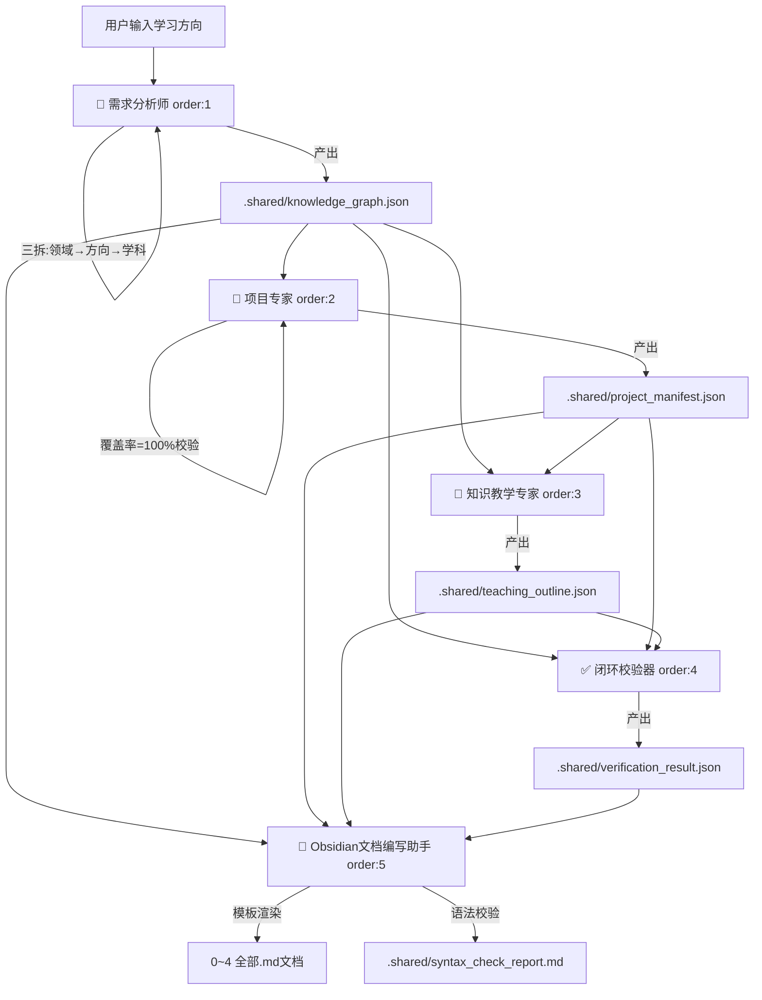

# 🧠 知识引擎编排器（Knowledge Engine Orchestrator）v2.6

**中文** | [English](./README-en.md)

> **一句话定义**：输入学习方向 → 需求分析师三拆锁定范围 → 五Skill按order自动串联 → 产出永久联动的 Obsidian 双链知识库。v2.6 重构为分布式自编排架构，各 Skill 独立通报执行状态。

---

## 📌 价值锚点

### 这个插件解决什么问题？

传统学习或课程设计过程中，你一定会遇到这三个致命痛点：

| 痛点 | 具体表现 |
| :--- | :--- |
| **📄 知识零散** | 知识点散落在各处，学了后面忘了前面，无法形成体系化认知。 |
| **🎯 学练脱节** | 学完理论找不到对应的真实项目去实践；做完项目又忘了背后的知识点。 |
| **🔗 文档孤岛** | 教学文档、项目文档、知识点清单互相独立，无法联动跳转，查找效率极低。 |

### 这个插件提供什么价值？

本插件内置五类 AI 专家，按 `schemas/pipeline.config.yml` 中定义的 `order` 顺序自动串联：

| order | Skill | 职责 |
|:---:|:---|:---|
| 1 | **需求分析师** | 三拆锁定范围 + 知识点体系化拆解 → `knowledge_graph.json` |
| 2 | **项目专家** | 100% 知识点映射至真实场景项目 → `project_manifest.json` |
| 3 | **知识教学专家** | 单元打包 + 五维教学结构 → `teaching_outline.json` |
| 4 | **闭环校验器** | 覆盖率/双链/依赖闭环校验 → `verification_result.json` |
| 5 | **Obsidian文档编写助手** | 模板渲染全部 5 个 Markdown 文档 + 语法自动修正 |

最终，你得到的不再是一堆零散的文档，而是一个**可终身维护、可双向跳转、可迭代扩展**的个人知识库。

---

## 🧩 适用人群

- 知识博主 / 课程设计师：快速生成体系化课程大纲与配套项目。
- 自学者：构建自己的学习路径，理论与实践同步推进。
- AI 教育产品开发者：将此流水线作为内容生产的基础设施。
- 任何希望将"输入方向"转化为"结构化知识资产"的人。

---

## 🔄 核心工作流



> **v2.6 架构要点**：
> - **插件入口**为 `skill/knowledge-analyst`（需求分析师），先通过"三拆"（领域→方向→学科）精准锁定学习范围，再进行知识拆解
> - **分布式自编排**：各 Skill 按 `schemas/pipeline.config.yml` 中的 `order` 独立执行并通报状态，不再依赖中央编排器
> - **独立状态通报**：每个 Skill 完成后输出 `[N/5]` 格式状态报告，含完成摘要 + 下一步提示 + 依赖文件路径
> - **两层分离**：层1（order:1-4）仅产出 JSON，层2（order:5）基于模板统一渲染全部 Markdown

---

## 📂 插件目录架构

```text
./
├── Skill.md                              ← 【兼容保留】v2.6 重定向入口
│
├── skill/                                ← 【执行层】5 个独立 Skill
│   ├── knowledge-analyst/Skill.md        ← [order:1] 需求分析师（插件入口）
│   ├── project-expert/Skill.md           ← [order:2] 项目专家
│   ├── knowledge-educator/Skill.md       ← [order:3] 知识教学专家
│   ├── verifier/Skill.md                 ← [order:4] 闭环校验器
│   └── obsidian-doc-writer/Skill.md      ← [order:5] Obsidian文档编写助手
│
├── schemas/                              ← 【规则层】Pipeline 配置 + JSON Schema
│   ├── pipeline.config.yml               ← order 顺序 + 运行规则
│   ├── knowledge_graph.schema.json
│   ├── project_manifest.schema.json
│   ├── teaching_outline.schema.json
│   └── verification_result.schema.json
│
├── templates/                            ← 【模板层】5 个标准化文档模板
│   ├── knowledge-checklist.template.md
│   ├── project-collection.template.md
│   ├── teaching-guide.template.md
│   ├── master-index.template.md
│   └── progress-tracker.template.md
│
├── docs/                                 ← 【设计文档】
│   └── 领域知识分析师-设计文档.md
│
└── 领域知识库/                           ← 【产出层】用户可见的最终知识资产
    └── [领域名称]/
        ├── .shared/                      ← 标准化 JSON 中间件（独立存储）
        │   ├── knowledge_graph.json
        │   ├── project_manifest.json
        │   ├── teaching_outline.json
        │   ├── verification_result.json
        │   └── syntax_check_report.md    ← 内部语法校验报告
        ├── 0-体系总索引.md
        ├── 1-领域知识点清单.md
        ├── 2-项目集.md
        ├── 3-领域知识教学指南.md
        └── 4-进度追踪看板.md
```

---

## 🚀 快速开始

### Step 1：环境准备

- 一个支持 Markdown 渲染的 AI 客户端（如 Obsidian + Copilot 插件）。
- 推荐使用 **Obsidian** 以获得最佳双链跳转体验。

### Step 2：安装插件

将本仓库所有文件复制到你的插件管理目录。

### Step 3：触发运行

在你的 AI 对话中输入：

> **"请使用知识分析师分析『提示词工程』"**

需求分析师将自动执行"三拆"锁定学习范围，确认后自动拆解知识点，随后按 order 顺序依次触发后续 Skill。

#### 带参数运行

> **"请使用知识分析师分析『Python数据分析』，拆分粒度=fine，风格=实践导向，知识点上限=80。"**

| 参数 | 可选值 | 默认值 | 说明 |
|:---|:---|:---|:---|
| `granularity` | `coarse` / `medium` / `fine` | `medium` | 知识点拆分粒度 |
| `depth_mode` | `overview` / `comprehensive` | `comprehensive` | 生成深度 |
| `max_knowledge_points` | 任意正整数 | `150` | 知识点数量上限 |
| `style_profile` | `academic` / `practical` / `certification` | `academic` | 风格预设 |

---

## 📄 产出物详解

| 文件 | 内容概要 | 核心价值 |
| :--- | :--- | :--- |
| **0-体系总索引.md** | 校验报告 + Mermaid 知识图谱 + 映射表 + 引用索引 + 学习路径 | 全局鸟瞰，映射表支持双向检索 |
| **1-领域知识点清单.md** | 结构化表格：ID、名称、难度、前置依赖、关联关系 | 领域知识骨架，一切产出的唯一事实来源 |
| **2-项目集.md** | 5+2 框架设计的完整项目（背景/思想/步骤/偏差/验收） | 每个项目覆盖一组知识点，验收含量化指标 |
| **3-领域知识教学指南.md** | 按教学单元组织的讲解（价值锚点+精讲+故事+拷问+钩子） | 钩子精确指向项目步骤，学完即练 |
| **4-进度追踪看板.md** | 按知识点 ID 罗列的 checkbox 清单 + 聚合进度统计 | 可视化学习进度追踪 |

---

## 🔄 断点续跑

插件自动检测 `领域知识库/[领域名称]/.shared/` 目录中的已有缓存：

- **自动跳过**：若对应 JSON 已存在且上游未更新，对应 Skill 询问是否复用
- **强制全量**：输入"强制全量重跑"忽略所有缓存
- **局部更新**：修改某 Skill 后只需重跑该 Skill + order:5（文档渲染）

每个 Skill 执行前会独立通报其状态：

```
✅ [1/5] 需求分析师 完成
   领域：计算机 / 方向：人工智能 / 学科：Python基础+数据分析
   共拆解 62 个知识点（入门级 20 / 进阶级 30 / 高级 12）
   ──────────────────────────
   下一步：请执行项目专家（order: 2）进行项目实践设计。
   依赖文件：领域知识库/人工智能-Python全栈基础/.shared/knowledge_graph.json
```

---

## 🎛️ 高级扩展

### 新增 Skill
在 `schemas/pipeline.config.yml` 中插入步骤（指定 order 和 depends_on），然后在 `skill/` 下创建对应 `Skill.md`。遵循层1仅产出 JSON、层2负责 Markdown 的职责分离原则。

### 新增文档类型
在 `templates/` 下创建 `.template.md`，在 `schemas/pipeline.config.yml` 中追加 outputs_markdown，在 `skill/obsidian-doc-writer/Skill.md` 中增加渲染逻辑。

---

## ⚠️ 注意事项

- **AI 生成属性**：所有产出物均由 LLM 自动生成，务必根据专业背景审核
- **ID 不可变性**：知识点ID（如 `PCE-001`）一旦生成终身不得修改
- **只读缓存**：`.shared/` 目录下 JSON 由系统自动维护，请勿手动修改

---

> 完整版本变更记录请参阅 [CHANGELOG.md](./CHANGELOG.md)。
