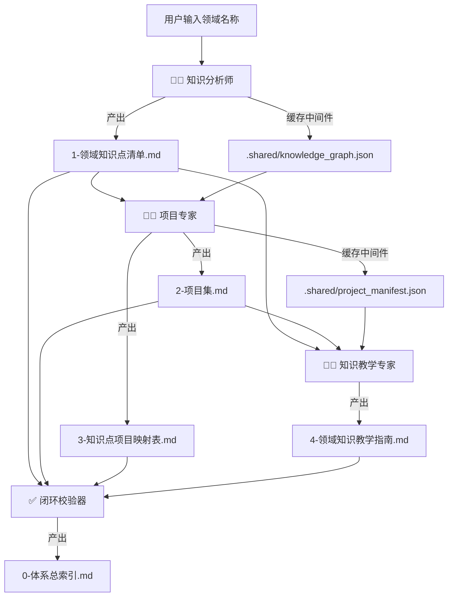

# 🧠 知识引擎编排器（Knowledge Engine Orchestrator）

**中文** | [English](./README-en.md)

> **一句话定义**：将任意领域知识“拆解 → 实战 → 教学”流水线化，产出永久联动的 Obsidian 双链知识库。

---

## 📌 价值锚点

### 这个插件解决什么问题？

传统学习或课程设计过程中，你一定会遇到这三个致命痛点：

| 痛点 | 具体表现 |
| :--- | :--- |
| **📄 知识零散** | 知识点散落在各处，学了后面忘了前面，无法形成体系化认知。 |
| **🎯 学练脱节** | 学完理论找不到对应的真实项目去实践；做完项目又忘了背后的知识点。 |
| **🔗 文档孤岛** | 教学文档、项目文档、知识点清单互相独立，无法联动跳转，查找效率极低。 |

### 这个插件提供什么价值？

本插件内置三位专属 AI 专家，按照“**先拆解、再实战、后教学**”的科学顺序，将你的任意输入领域（如“提示词工程”、“Python数据分析”）自动转化为一套**高度结构化、双链互通**的 Obsidian 知识资产：

1. **知识分析师** → 穷尽该领域所有核心知识点，形成依赖图谱。
2. **项目专家** → 将每个知识点映射到真实场景项目，100% 覆盖。
3. **知识教学专家** → 将知识点打包为易学的“教学单元”，并精确锚定到对应项目步骤。

最终，你得到的不再是一堆零散的文档，而是一个**可终身维护、可双向跳转、可迭代扩展**的个人知识库。

---

## 🧩 适用人群

- 知识博主 / 课程设计师：快速生成体系化课程大纲与配套项目。
- 自学者：构建自己的学习路径，理论与实践同步推进。
- AI 教育产品开发者：将此流水线作为内容生产的基础设施。
- 任何希望将“输入领域”转化为“结构化知识资产”的人。

---

## 🔄 核心工作流

下图展示了插件内部三个 Skill 的**严格顺序联动**以及产出物流向：



> **设计要点**：
> - **顺序强制**：必须先有知识点清单，才能设计项目；必须先有项目 ID，才能让教学指南精确锚定。
> - **缓存解耦**：`.shared/` 目录下的 JSON 文件作为标准化中间件，确保各 Skill 之间的数据传递稳定可靠。
> - **人机分离**：JSON 供机器读取（下游 Skill 依赖），Markdown 供人类阅读和 Obsidian 渲染，各司其职。

---

## 📂 插件目录架构

```text
./
├── Skill.md                              # 【核心】总编排器，定义流水线与扩展规范
│
├── _agents/                              # 【扩展仓】存放所有子 Skill 定义
│   ├── knowledge-analyst.md
│   ├── project-expert.md
│   └── knowledge-educator.md
│
├── .shared/                              # 【缓存层】标准化中间产物（自动生成，请勿手动修改）
│   ├── knowledge_graph.json
│   ├── project_manifest.json
│   └── teaching_outline.json
│
└── 领域知识库/                           # 【产出层】用户可见的最终知识资产
    └── [你输入的领域名称]/
        ├── 0-体系总索引.md               # 闭环校验：覆盖率地图 + 全量引用热力图
        ├── 1-领域知识点清单.md           # 知识分析师产出
        ├── 2-项目集.md                   # 项目专家产出
        ├── 3-知识点项目映射表.md         # 项目专家产出
        └── 4-领域知识教学指南.md         # 知识教学专家产出
```

---

## 🚀 快速开始（3 步上手）

### Step 1：环境准备

- 一个支持 Markdown 渲染的 AI 客户端（如 Obsidian + Copilot 插件，或直接在本项目对话界面使用）。
- 推荐使用 **Obsidian** 以获得最佳双链跳转体验，但纯文本编辑器也可正常阅读。

### Step 2：安装插件

将本仓库所有文件克隆或复制到你的插件管理目录（例如 `your-obsidian-vault/.plugins/knowledge-engine/`）。

### Step 3：触发运行

在你的 AI 对话中输入以下指令（示例）：

> **“请使用知识引擎构建『提示词工程』的完整知识库。”**

系统将自动执行全流水线，并在 `领域知识库/提示词工程/` 目录下生成全部 5 份 Markdown 文档。

---

## 📄 产出物详解（你将得到什么）

| 文件 | 内容概要 | 核心价值 |
| :--- | :--- | :--- |
| **0-体系总索引.md** | 全量知识图谱 Mermaid 图 + 每个知识点 ID 的“被引用位置”列表 | 全局鸟瞰，快速定位任意知识点的关联项目与教学章节 |
| **1-领域知识点清单.md** | 结构化表格：ID、名称、难度、前置依赖、关联关系 | 完整的领域知识骨架，是一切后续产出的唯一事实来源 |
| **2-项目集.md** | 按 5+2 框架（背景/思想/步骤/偏差/验收 + 映射表）设计的完整项目 | 每个项目都覆盖一组知识点，且验收标准附带**量化指标示例** |
| **3-知识点项目映射表.md** | 双向检索表：知识点 ID ↔ 项目 ID ↔ 应用环节 | 随时反查“这个知识点在哪个项目的哪个步骤被用到” |
| **4-领域知识教学指南.md** | 按“教学单元”组织的讲解内容（价值锚点+精讲+故事+拷问+实战钩子） | 每个单元末尾的“实战钩子”精确指向 `[[2-项目集#Proj-XXX]]`，学完即练 |

---

## 🔗 Obsidian 双向链接示例

打开任意一份产出文档，你会看到类似以下格式的内链：

```markdown
# 4-领域知识教学指南.md

## 教学单元 EDU-003：Pandas 数据清洗

### 实战钩子
> 本单元知识点将在 [[2-项目集#Proj-002|项目 Proj-002 步骤 2.3]] 中被刻意应用。
> 届时请注意：如果缺失值比例超过 30%，你可能会遇到 [[1-领域知识点清单#PCE-007|PCE-007 异常值检测]] 中提到的“统计偏差放大”现象。
```

在 Obsidian 中，Cmd/Ctrl + 单击链接即可**一键跳转**到对应项目的具体步骤，实现“教学指南 ↔ 知识点清单 ↔ 项目集”三方互跳，永不迷路。

---

## 🎛️ 高级玩法（灵活调度与扩展）

### 局部重跑（节省 Token，加速迭代）

如果你只需要重新生成“教学指南”而不想重新拆解知识点和设计项目，可以：

1. 打开 `Skill.md` 文件。
2. 在 `pipeline` 配置中，将 `step-analyze` 和 `step-project` 的 `enabled` 改为 `false`。
3. 再次触发运行命令。

系统将**自动跳过**前两步，直接读取 `.shared/` 中已有的缓存 JSON，仅执行教学专家阶段。

### 新增自定义 Skill（热插拔扩展）

假设未来你想增加一个“面试题库生成器”，只需：

1. 在 `_agents/` 目录下新建 `interview-generator.md`，定义其角色与输出格式。
2. 在 `Skill.md` 的 `pipeline` 列表中追加一个新步骤：

```yaml
- id: step-interview
  agent: _agents/interview-generator.md
  depends_on: [step-teach]
  input_source: ".shared/teaching_outline.json"
  outputs_markdown: ["领域知识库/[领域名称]/5-面试题库.md"]
  enabled: true
```

无需改动任何现有文件，新 Skill 即可无缝接入流水线。

---

## ⚠️ 注意事项与约束声明

- **AI 生成属性**：所有产出物均由 LLM 自动生成，请使用者务必根据自身专业背景进行最终审核与调整，确保内容准确无误。
- **ID 不可变性（极其重要）**：为保障 Obsidian 双链的永久稳定，`知识点ID`（如 `PCE-001`）一旦生成，**终身不得修改**。若某个知识点需要调整，请采用“标记为废弃 + 新增 ID”的方式迭代，切勿直接重命名或删除 ID。
- **只读缓存**：`.shared/` 目录下的 JSON 文件由系统自动维护，**请勿手动修改**，否则可能导致下游 Skill 读取异常。

---

## 📜 版本记录

| 版本 | 日期 | 更新内容 |
| :--- | :--- | :--- |
| v1.0.0 | 2026-06-25 | 初始版本发布：包含知识分析师、项目专家、知识教学专家三大 Skill，支持 Obsidian 双链与热插拔扩展 |

---

## 🤝 贡献与反馈

欢迎提交 Issue 或 PR 来改进本插件。如果你有新的 Skill 想要集成，也请参考“高级玩法”中的扩展规范进行贡献。

---

**Happy Building！让你的知识资产从此“活”起来。** 🚀
