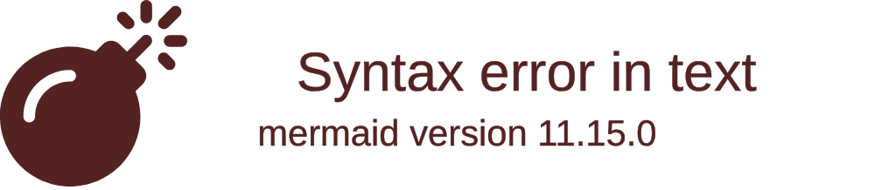

---
tags:
  - {{DOMAIN}}
  - 进度追踪
  - 学习管理
aliases:
  - 进度追踪看板
---

# 进度追踪看板：{{DOMAIN}}

> [!info] 文档说明
> 本文档由 **Obsidian文档编写助手** 基于校验结果自动生成，用于追踪知识学习与项目实践的进度。

---

## 知识点学习进度

| 知识点ID | 知识点名称 | 难度 | 状态 | 关联项目 | 教学单元 |
|:---|:---|:---|:---:|:---|:---|
{{#EACH KP_TRACKER}}
| {{KP_ID}} | {{KP_NAME}} | {{DIFFICULTY}} | ⬜ 未开始 | {{PROJECT_LINKS}} | {{TEACHING_LINKS}} |
{{/EACH}}

> [!tip] 状态说明
> - ⬜ 未开始
> - 🔄 进行中
> - ✅ 已完成

---

## 项目实践进度

| 项目ID | 项目名称 | 难度 | 状态 | 覆盖知识点数 |
|:---|:---|:---|:---:|:---:|
{{#EACH PROJECT_TRACKER}}
| [[2-项目集#{{PROJ_ID}} {{PROJ_NAME}}]] | {{PROJ_NAME}} | {{DIFFICULTY}} | ⬜ 未开始 | {{KP_COUNT}} |
{{/EACH}}

> [!tip] 状态说明
> - ⬜ 未开始
> - 🔄 进行中
> - ✅ 已完成

---

## 教学单元进度

| 单元ID | 单元名称 | 难度 | 状态 | 关联项目 |
|:---|:---|:---|:---:|:---|
{{#EACH EDU_TRACKER}}
| [[3-领域知识教学指南#{{EDU_ID}} {{EDU_NAME}}]] | {{EDU_NAME}} | {{DIFFICULTY}} | ⬜ 未开始 | {{PROJECT_LINKS}} |
{{/EACH}}

---

## 整体进度概览

> [!note] 生成信息
> 本看板由知识体系构建引擎 v{{ENGINE_VERSION}} 自动生成，数据源：`verification_result.json`。完成进度需手动更新。
